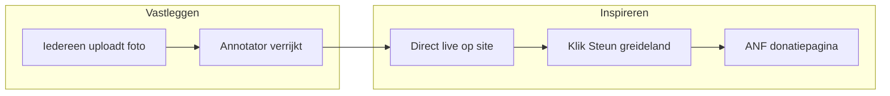

# Greidefugels / Weidevogels — plan v2

MVP-ontwerp: **foto uploaden → annotatie → publiceren → donatie stimuleren**.

---

## 1. Doel in één zin

Bezoekers raken geïnspireerd door echte greidemomenten (foto + verhaal) en kunnen met één klik ANF steunen; vrijwilligers leggen die momenten vast via upload en annotatie.

---

## 2. Voor wie?

| Groep | Wat willen ze? |
|---|---|
| **Bezoeker / publiek** | Mooie, begrijpelijke verhalen over weidevogels zien; vertrouwen voelen; eenvoudig doneren |
| **Vrijwilliger / boer / school** | Snel een foto delen van het greideland, zonder ingewikkelde formulieren |
| **Annotator (vogelwacht / ANF)** | Foto verrijken met soort, gedrag en een korte, publiceerbare tekst |
| **ANF / beheerder** | Kwaliteit bewaken, publiceren, zien hoeveel momenten en donatieklicks er zijn |
| **Sponsor / partner** | *Buiten MVP v1* — later koppelen aan projecten of logo |

---

## 3. Kern (max. 3 flows voor MVP)

### Flow 1 — Greidemoment delen (upload)

1. Ingelogde **contributor** kiest een **ANF-project** (bijv. Ljippelân, Gruttoland).
2. Uploadt **één foto** (JPG/PNG, max. 10 MB).
3. Optioneel: korte toelichting (“waar/wanneer gezien”).
4. Systeem slaat EXIF-datum op (indien aanwezig) en zet status op **wacht op annotatie**.
5. Bevestiging: “Bedankt — een vrijwilliger maakt er een verhaal van.”

### Flow 2 — Foto verrijken (annotatie)

1. Ingelogde **annotator** ziet een **wachtrij** (oudste eerst).
2. Per foto vult hij/zij in:

   | Veld | Verplicht | Voorbeeld |
   |---|---|---|
   | Soort | ja | Grutto |
   | Aantal (indicatie) | ja | 2 |
   | Gedrag | ja | Baltsend op wei |
   | Seizoen | ja | Lente |
   | Verhaalregel (publiek) | ja | “Twee grutto’s dansen op het natte land.” |
   | Langere toelichting | nee | Context voor bezoeker |
   | Publiceerbaar | ja | ja/nee |

3. Opslaan → status **klaar voor publicatie** (admin keurt goed).

*Optioneel in v1.1:* AI-voorscan (OpenAI Vision) vult velden voor als suggestie; annotator corrigeert altijd.

### Flow 3 — Inspireren & doneren (publiek)

1. Bezoeker opent **Momenten** (feed) of **homepage-highlight**.
2. Ziet foto + verhaalregel + projectnaam + datum.
3. Detailpagina met langere tekst (indien ingevuld).
4. Prominente knop **“Steun dit greideland”** → doorlink naar ANF-donatiepagina (extern), met tracking (UTM + click-log).
5. Optioneel op homepage: teller “X greidemomenten · Y keer gesteund”.

---

## 4. Buiten scope (bewust niet in v1)

- Betalingen in de app (alleen doorlink naar ANF)
- Partnerportaal, sponsor-dashboard, PDF-rapportages
- QR-codes per school / directe upload zonder login
- Meertalig (alleen NL)
- Social share cards, Open Graph generator
- Queue/worker voor AI (eerst handmatige annotatie; AI later)
- Volledige CMS, blog, nieuwsbrief

---

## 5. Techniek (voorstel)

| Onderdeel | Keuze |
|---|---|
| Framework | Laravel 13 ✓ |
| Database | **MySQL op Plesk** (productie); SQLite lokaal |
| Auth | Laravel Breeze (login, rollen) |
| Foto-opslag | `storage/app/public/observations/` + symlink |
| Rollen | `contributor`, `annotator`, `admin` |
| Donatie | Externe URL (ANF) + `donation_clicks` tabel |
| AI / foto | **Nee in v1** — handmatige annotatie; Vision in v1.1 |
| Talen | NL |

### Datamodel (MVP)

```
projects          observations              annotations
─────────         ─────────────             ───────────
id                id                        id
name              project_id                observation_id
slug              user_id (uploader)        species
description       photo_path                count_label
active            status (enum)             behavior
                  exif_taken_at             season
                  contributor_note          story_line
                  published_at              caption
                                            is_publishable

donation_clicks
───────────────
id, observation_id (nullable), ip_hash, created_at
```

**Statussen observation:** `pending_annotation` → `ready_for_review` → `published` (of `rejected`).

---

## 6. Schermen (MVP)

| Route | Wie | Functie |
|---|---|---|
| `/` | publiek | Homepage + laatste 3 momenten + donatie-CTA |
| `/momenten` | publiek | Feed gepubliceerde momenten |
| `/momenten/{slug}` | publiek | Detail + donatieknop |
| `/steun` | publiek | Uitleg + algemene donatielink ANF |
| `/upload` | contributor | Foto uploaden |
| `/annoteren` | annotator | Wachtrij + formulier |
| `/admin` | admin | Dashboard, publiceren, afkeuren |
| `/login` | iedereen | Inloggen |

---

## 7. Donatie-actie (concept)

**Naam campagne:** *“Deel wat je ziet — steun wat leeft”*

**Mechanisme (simpel, meetbaar):**

1. Elk gepubliceerd moment krijgt een vaste donatieknop.
2. Klik wordt gelogd (anoniem, geen cookies nodig voor MVP).
3. Redirect naar ANF met vaste UTM, bijv.  
   `https://www.agrarischnatuurfondsfryslan.nl/steun?utm_source=greidefugels&utm_medium=moment&utm_campaign=weidevogels`
4. Admin ziet: aantal momenten, aantal donatieklicks (niet het bedrag — dat blijft bij ANF).

**Waarom dit werkt voor MVP:** emotionele foto + kort verhaal → directe call-to-action, zonder payment-integratie.

---

## 8. Fases

### Fase A — klaar ✓

- [x] Laravel live op greidefugels.nl
- [x] Eenvoudige homepage (merk + uitleg)
- [x] SSL + deploy-script

### Fase B — MVP (foto → annotatie → donatie)

- [x] Migraties: projects, observations, annotations, donation_clicks
- [x] Rollen + seed (Ljippelân, admin, annotator)
- [x] Auth (login vrijwilligers/beheer)
- [x] Open upload (zonder account)
- [x] Annotatiewachtrij + direct publiceren
- [x] Momenten-feed + detail + donatieknop
- [x] Admin: statistieken + offline halen

### Fase C — later

- [ ] AI-voorscan (Vision) als suggestie voor annotator
- [ ] Sponsors / projectpartners
- [ ] QR upload per school
- [ ] Share cards / social preview
- [ ] Partner notificaties bij publicatie

---

## 9. Besluiten ✓

1. **Upload zonder account** — ja, open upload (optionele naam/e-mail)
2. **Project** — alleen **Ljippelân** (`ljippelan`)
3. **Donatie-URL** — ANF-steunpagina met UTM (`config/greidefugels.php`)
4. **Annotators** — meerdere vrijwilligers (eigen login)
5. **Publicatie** — direct live als annotator “Direct publiceren” aanvinkt; admin kan offline halen

---

## 10. User journey (overzicht)



---

## 11. Demo-accounts (na seed)

| Rol | E-mail | Wachtwoord |
|---|---|---|
| Admin | admin@anf.local | password |
| Annotator | annotator@anf.local | password |

*Wijzig wachtwoorden op productie.*

---

*Fase B is gebouwd — deploy + `php artisan migrate --seed` + `storage:link` op server.*
